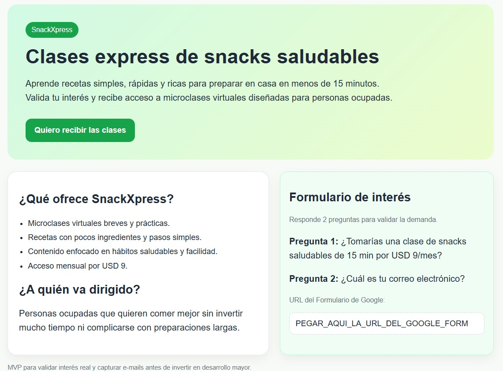

# SnackXpress — Módulo 3

## Resumen

SnackXpress es una propuesta Lean Startup de microclases virtuales para aprender a preparar snacks saludables en casa. El servicio está diseñado para personas ocupadas que desean cuidar su alimentación, pero necesitan ideas simples, rápidas y fáciles de aplicar.

La propuesta ofrece recetas prácticas que pueden prepararse en menos de 15 minutos mediante clases breves y una guía sencilla.

## Vista del MVP

El MVP presenta una landing page para explicar la propuesta de valor, mostrar los beneficios de las microclases y capturar interés mediante un formulario. Esta versión permite validar la demanda antes de desarrollar una plataforma completa.

## Problema

Muchas personas quieren comer de forma más saludable, pero tienen poco tiempo y no cuentan con ideas rápidas para preparar snacks en su día a día.

## Público objetivo

Personas ocupadas que cuidan su alimentación y buscan alternativas prácticas para preparar snacks saludables sin invertir mucho tiempo.

## Visión

### Propósito

Promover hábitos saludables con clases cortas y prácticas de snacks en casa.

### Misión

Ayudar a personas ocupadas a aprender recetas simples de snacks saludables en menos de 15 minutos.

### Valores

- Salud
- Simplicidad
- Aprendizaje continuo

## Propuesta de valor

Clases express para preparar snacks fáciles, saludables y aplicables en menos de 15 minutos.

La propuesta se diferencia por ofrecer contenido práctico, breve y fácil de seguir, adaptado a agendas con poco tiempo disponible.

## Lean Canvas

| Bloque | Definición |
|---|---|
| Problema | Falta de ideas rápidas para preparar snacks saludables |
| Segmento de clientes | Personas ocupadas que cuidan su alimentación |
| Propuesta de valor | Clases express para snacks fáciles y sanos |
| Solución | Microclases virtuales con recetas y guía simple |
| Canales | Landing page, redes sociales y correo |
| Ingresos | USD 9 al mes por acceso a las clases |
| Costos | Diseño, plataforma, difusión y contenido |
| Métricas clave | E-mails captados, conversión y retención |
| Ventaja injusta | Contenido práctico, rápido y fácil de aplicar |

## MVP e hipótesis de valor

### Hipótesis

Si SnackXpress ofrece clases de snacks saludables por USD 9 al mes, al menos el 25 % de las personas que visiten la landing page dejará su correo electrónico para recibir más información.

### MVP

Una landing page sencilla creada en Google Sites con un botón que dirige a un Google Form de dos preguntas: interés por el servicio y correo electrónico.

Formulario del MVP: https://forms.gle/eN8PKX2aQeCuEFPA8

### Métrica de validación

La métrica principal es la conversión de visitantes que dejan su correo electrónico.

**Meta inicial:** alcanzar una conversión mínima del 25 %.

## Esquema de validación

1. Publicar la landing page y dirigir tráfico inicial desde redes sociales, correo u otros canales.
2. Medir visitantes, e-mails captados y tasa de conversión.
3. Comparar el resultado con la meta de 25 %.
4. Perseverar y avanzar hacia la oferta de pago si se alcanza la meta.
5. Pivotar la propuesta de valor, el mensaje, el precio o el canal si no se alcanza la meta.

## Modelo de ingresos

El modelo inicial contempla una suscripción de USD 9 al mes para acceder a las microclases y guías de recetas.

## Métricas de éxito

| Métrica | Qué permite evaluar |
|---|---|
| E-mails captados | Nivel inicial de interés por el producto |
| Conversión | Porcentaje de visitantes que dejan sus datos |
| Retención | Capacidad de mantener usuarios activos después de la validación |

## Mi aporte como Product Owner

- Definí el problema, el segmento objetivo y la propuesta de valor.
- Elaboré la visión, misión y valores del producto.
- Construí un Lean Canvas para sintetizar el modelo de negocio.
- Diseñé un MVP de bajo costo para validar interés antes de desarrollar una plataforma completa.
- Definí una hipótesis medible, un baseline de conversión y criterios para perseverar o pivotar.
- Propuse canales de adquisición, modelo de ingresos y métricas para guiar decisiones posteriores.

## Aprendizajes

Este caso demuestra la importancia de validar una necesidad real antes de invertir en el desarrollo completo de un producto. Un MVP simple permite aprender rápidamente sobre el interés de los usuarios, medir resultados y decidir con evidencia si se debe avanzar, ajustar o pivotar.
